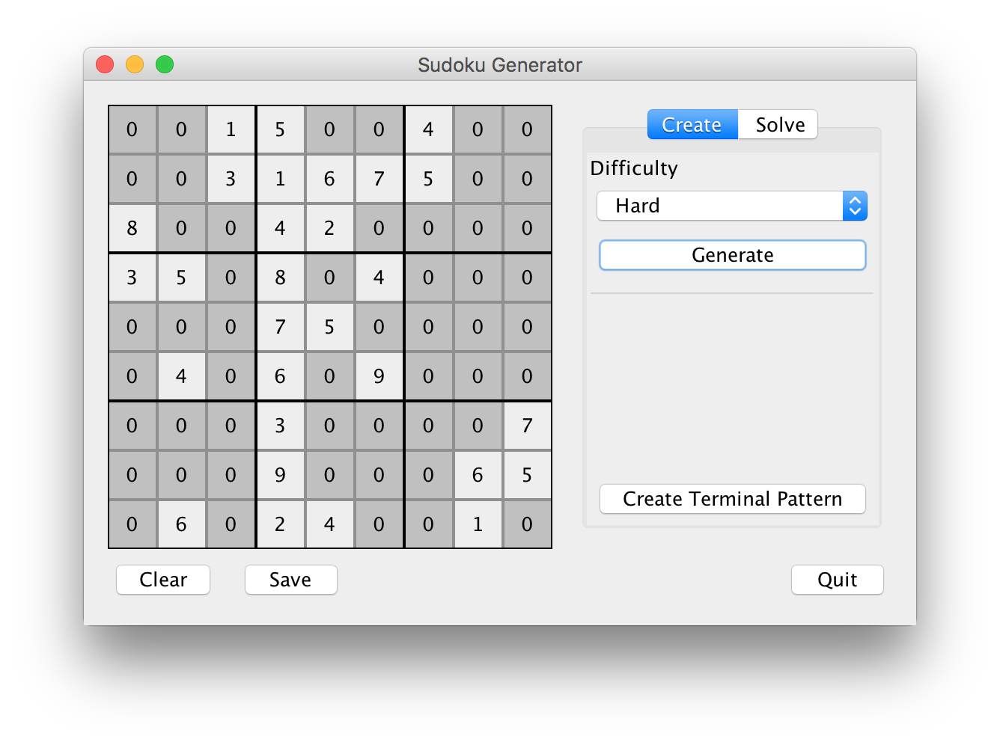
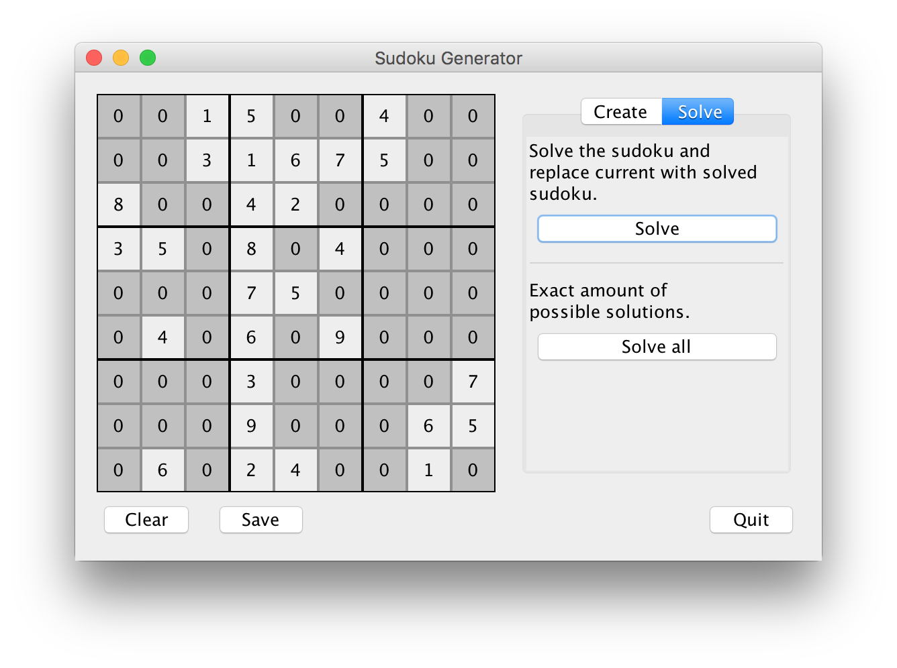
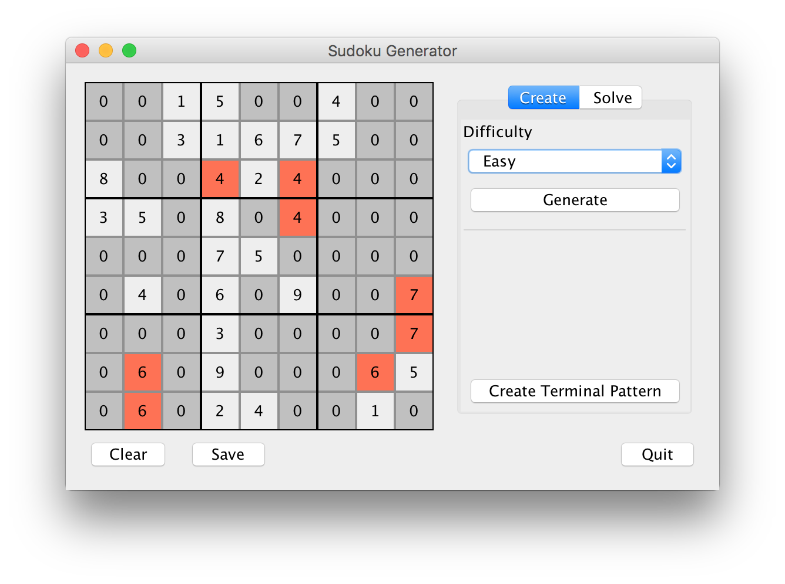

# Sudoku-Generator
<i>Sudoku Generator</i> is a creates sudokus in five different difficulty levels. Those are:
<b>
  - Extremly Easy
  - Easy
  - Medium
  - Hard
  - Devil's Playground</b> (you would be the first to solve one of those)
 
The GUI also gives access to internal features used while generating the sudoku. So is it possible to solve any sudoku, get the number of unique sudokus that could be generated with the input (A correctly solvable sudoku has just one solution) and create random terminal patterns. 

The GUI is also easy to use and it is very simple to type in generators into the given sudoku field. The from the creator recommended way is a simple type-in and change focus with tab. This will circle through all fields.
The GUI also finds live during type-in errors in the sudoku and will mark any rule breaking numbers red. This behaviour support the type in of any sudoku.

The generated sudoku (with any method) can saved with different endings. Those are

  - <b>.txt </b>- normal text file
  - <b>.pdf </b> - a vector, squared pdf file

<pre>
     9 |     3 |     2
   3 5 |   4   | 7    
 2 4 8 | 6   7 | 9 5 3
-------|-------|-------
       |       |   7 8
 9     |       | 1    
       | 4 2   |      
-------|-------|-------
       | 8 3   |      
 4     |   7   |      
     2 |     6 |     1
</pre>
An example txt output.

 
An example pdf file with the same sudoku field.

# How to compile
The program is writen with the IntelliJ IDEA and uses its standard compiler, but also its GUI Designer. Using this IDE will also automaticly download all depencies. But the code can also be compiled with any another compiler running with JDK version 1.8, as long as the GUI Designer methods are correctly interpreted. The libraries used in this project are:  

<pre>de.erichseifert.vectorgraphics2d:VectorGraphics2D:0.10</pre>
This library is used to create vector PDFs, it extends the Graphics2D class 

<pre>it.unimi.dsi:dsiutils:2.3.3</pre>
The only use is for the XoRoShiRo128PlusRandom class. This was many implemented for fun and can be every occurence can be replaced with the normal Java Random library. This would make this library needless.

# Screenshots
 
The normal window after it generated a hard puzzle.  
 
The menus under the solve tab.  
 
The GUI, when there are conflicts in the field.
